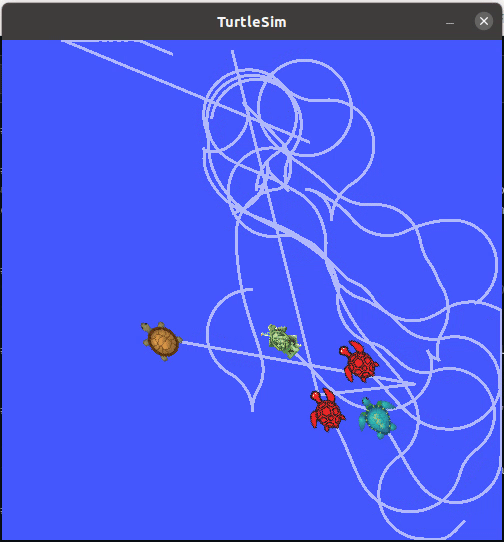

# Mülakat Soruları 

## 1. **N Faktöriyel Sayısının Sondan Kaç Basamağının Sıfır Olduğunu Hesaplama**

### Açıklama:
Faktöriyel, bir sayının kendisi ve kendisinden küçük tüm pozitif tam sayıların çarpımını ifade eder. Örneğin, `5! = 5 * 4 * 3 * 2 * 1 = 120`. N! sayısının sonunda kaç tane sıfır olduğunu hesaplamak için, 10'a bölünebilen çarpanları (yani 2 ve 5) saymamız gerekmektedir. Bir faktöriyel sayısının sonunda sıfır sayısını hesaplamak için, N'nin 5'in katlarına bölünebilen sayılarını saymalıyız.

### Örnek:
**Girdi:** `64`  
**Çıktı:** `14` (64! sayısının sondan 14 basamağı sıfırdır.)

## 2. **Aritmetik Operatör Kullanmadan İki Sayıyı Toplama**

### Açıklama:
Bu soruda, iki sayıyı toplama operatörü (+) veya diğer aritmetik operatörleri kullanmadan toplamanın bir yolunu bulmamız isteniyor. Burada bit düzeyinde işlemler kullanılarak toplama yapılabilir. XOR ve AND bit operatörleri ile sayılar arasında toplama işlemi gerçekleştirebiliriz.

### Örnek:
**Girdi:** `3, 5`  
**Çıktı:** `8`

## 3. **Sıfırdan N’e Kadar Kaç Adet 3 Rakamı Kullanıldığını Hesaplama**

### Açıklama:
Bu soruda, sıfırdan N'e kadar olan sayıların her birinin içerisinde kaç adet "3" rakamının geçtiğini saymamız isteniyor. Bu, her sayıyı tek tek kontrol ederek çözebileceğimiz bir problemdir.

### Örnek:
**Girdi:** `37`  
**Çıktı:** `12` (0 ile 37 arasındaki sayılarda 12 adet "3" rakamı kullanılmıştır.)

## 4. **Histogramda Su Miktarını Hesaplama**

### Açıklama:
Bu soruda, bir histogramın içine su dökülmesini simüle etmemiz isteniyor. Histogramdaki her bir sütun bir akvaryum bölmesi gibi düşünülebilir. Su döküldüğünde, her iki sütun arasındaki boşluklar su ile dolacaktır. Su miktarını hesaplamak için, her iki sütun arasındaki yüksekliği ve genişliği kullanarak suyun hacmini hesaplayabiliriz.

### Örnek:
**Girdi:** `[0, 0, 4, 0, 0, 6, 0, 0, 3, 0, 8, 0, 2, 0, 5, 2, 0, 3, 0, 0]`  
**Çıktı:** `46m3` (Bu histogram, toplamda 46 metreküp su alır.)

## 5. **ROS Noetic ve TurtleSim Kullanarak Aşağıdaki Görevlerin Gerçekleştirilmesi**

### a. **“teleop_twist_keyboard” Paketi ile Kaplumbağa Hareket Ettirme**

**Açıklama:**  
`teleop_twist_keyboard` paketini kullanarak kaplumbağayı yön tuşlarıyla hareket ettirebilirsiniz. Bu paket, kullanıcıdan alınan komutlarla kaplumbağanın hareketini sağlar.

### b. **“/turtles_create” Servisi ile Kaplumbağa Oluşturma**

**Açıklama:**  
Bu servise istenilen sayıda kaplumbağa gönderildiğinde, TurtleSim çalışma alanı içinde rastgele konum ve oryantasyonlarda kaplumbağalar oluşturulmalıdır. Her yeni kaplumbağa bir servis ile oluşturulacaktır.

### c. **“/turtles_follow” Servisi ile Kaplumbağaların Takip Etmesi**

**Açıklama:**  
Bu servise bir kaplumbağanın ismi gönderildiğinde, diğer kaplumbağalar bu kaplumbağayı takip etmelidir. Eğer belirtilen kaplumbağa çalışma alanında bulunmuyorsa, bir hata mesajı döndürülmelidir. Eğer kaplumbağa mevcutsa, tüm takipçilerin lideri takip etmesini sağlamak gereklidir.

**Servis Yanıtı:**  
- Eğer verilen kaplumbağa mevcutsa, “OK” mesajı döndürülmelidir.
- Eğer kaplumbağa mevcut değilse, hata mesajı ve mevcut kaplumbağaların isimleri döndürülmelidir.

